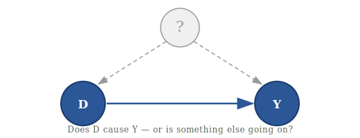
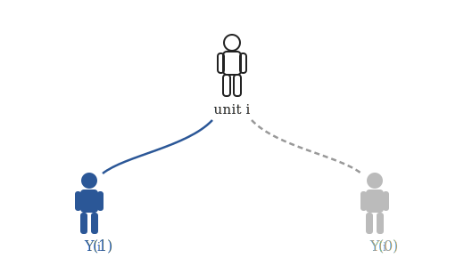

# PS200C: Causal Inference for the Social Sciences

  
  

**Instructor:** Chad Hazlett ([chazlett@ucla.edu](mailto:chazlett@ucla.edu))
**Quarter:** Spring 2026
**Department:** Political Science, UCLA

This course covers the core methods of causal inference used in the social sciences: potential outcomes, randomized experiments, selection on observables, difference-in-differences, instrumental variables, sensitivity analysis, regression discontinuity, and DAGs/structural causal models.

## Course Materials

- [Syllabus](syllabus.html)
- [Slides](slides.html)
- [Resources](resources.html)
- [Final Project](projects.html)
- [Section](section.html)
