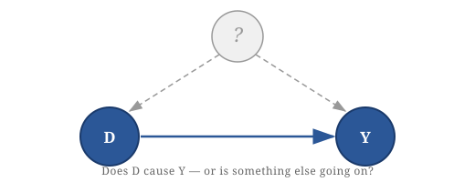
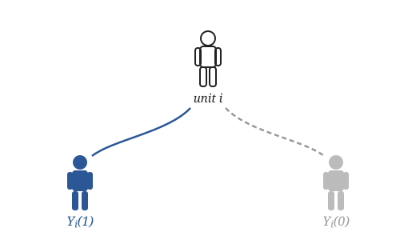

# PS200C: Causal Inference for the Social Sciences

  
  

*Class:* MW 2:00–3:15 PM, Bunche 2160
*Section:* Friday 9:00–9:50 AM, on [Zoom](https://ucla.zoom.us/j/94794109684)

**Professor:** Chad Hazlett — [chazlett@ucla.edu](mailto:chazlett@ucla.edu)
*Office Hours:* Wednesday 3:30–4:45 PM and by appointment, Bunche 3264

**Teaching Assistant:** Barney Chen — [barneychen@ucla.edu](mailto:barneychen@ucla.edu)
*Office Hours:* Mondays 5 PM at Bunche 3244 and by appointment

**Course website:** <https://chadhazlett.github.io/ps200c-2026/>
**Announcements:** [BruinLearn](https://bruinlearn.ucla.edu) — make sure you are receiving notifications.

This course covers the core methods of causal inference used in the social sciences: potential outcomes, randomized experiments, selection on observables, difference-in-differences, instrumental variables, sensitivity analysis, regression discontinuity, and DAGs/structural causal models.

## Course Materials

- [Syllabus](syllabus.html)
- [Slides and exercises](slides.html)
- [Resources](resources.html)
- [Final Project](projects.html)
- [Section](section.html)
